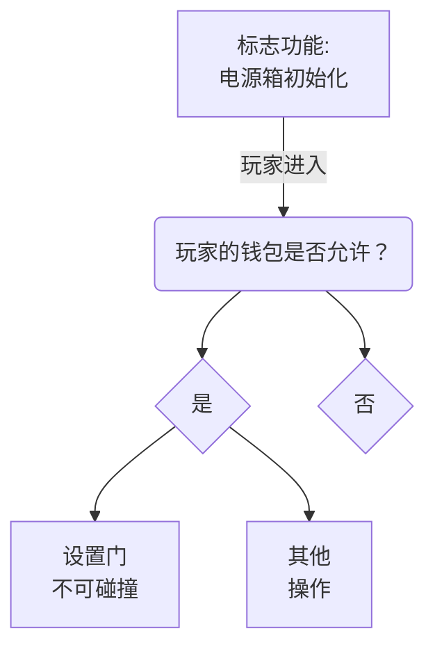

# 限制与某些钱包的交互

在这里，我们将讨论您可能希望将对一些功能的访问限制在有限数量的人员或一个特定地址上。与此相反，您也可以轻松修改此脚本以阻止特定地址的访问。

## 1. 工作原理
以下是脚本如何工作的简要图示：


这个脚本几乎要求您将所有脚本都写在一个功能内。最好是一个加载速度快的功能，比如一个标志。

您在“否”节点之后看不到其他操作的原因是，我制作此脚本时假设这些功能默认是不可访问（或不可碰撞）的。

## 2. 脚本
## 脚本 {.tabset}
### 允许多个地址
```js
let AllowedPlayers=["0x0fA074262d6AF761FB57751d610dc92Bac82AEf9","..."] // 允许的玩家列表

// 获取功能
let door = parcel.getFeatureById('door')

// 大写地址，因为地址将永远不匹配。
AllowedPlayers.forEach((p,i)=>{
  AllowedPlayers[i]=p.toUpperCase() 
})

// 开始监听玩家
parcel.on('playerenter',e=>{
  if(AllowedPlayers.includes(e.player.wallet.toUpperCase())){ 
    // 如果包含钱包，将门设置为不可碰撞
    door.set({collidable:false})
    /* 在这里执行其他操作 */
  }
})
```
### 允许一个地址
```js
let AllowedPlayers="0x0fA074262d6AF761FB57751d610dc92Bac82AEf9" // 允许的玩家列表

// 获取功能
let door = parcel.getFeatureById('door')

// 开始监听玩家
parcel.on('playerenter',e=>{
  if(AllowedPlayers.toUpperCase()==e.player.wallet.toUpperCase()){ 
    // 如果包含钱包，将门设置为不可碰撞
    door.set({collidable:false})
    /* 在这里执行其他操作 */
  }
})
```
### 禁止地址
```js
let banPlayers=["0x0fA074262d6AF761FB57751d610dc92Bac82AEf9","..."] // 禁止的玩家列表

// 获取功能，玩家不能与之交互
let door = parcel.getFeatureById('door')

// 大写地址，因为地址将永远不匹配。
banPlayers.forEach((p,i)=>{
  banPlayers[i]=p.toLowerCase() 
})

// 开始监听玩家
parcel.on('playerenter',e=>{
  if(banPlayers.includes(e.player.wallet.toLowerCase())){ 
    // 如果包含钱包，将门设置为可碰撞
    door.set({collidable:true})
    /* 在这里执行其他操作 */
  }
})
```

#
:::警告
不建议在激活了网格的情况下使用此脚本。允许一个玩家将为其他所有人激活门。
:::