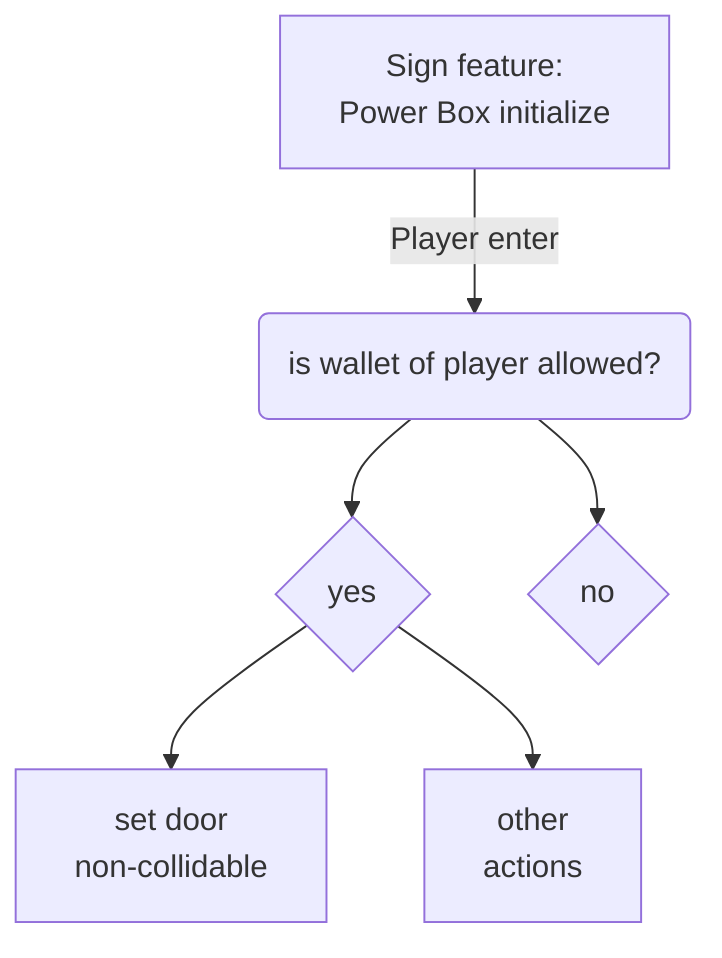

Here we go over the possibility that you want to limit access to some features to a limited number of people, or to one specific address.
In contrast, you can also easily modify this script to block a specific address.

# 1. How it works.
Here is a quick diagram on how the script works:


This scripts pretty much requires you to write all your script within one feature. Ideally a feature that loads fast, such as a sign.

The reason you see no other action after the `No` node, is because I made this script assuming the features would be non-accessible (or collidable) by default.

# 2. The scripts
# Scripts {.tabset}
## Allow multiple address
```js
let AllowedPlayers=["0x0fA074262d6AF761FB57751d610dc92Bac82AEf9","..."] // list of allowed players

//get features
let door = parcel.getFeatureById('door')

//Capitalize the addresses because the addresses will never match.
AllowedPlayers.forEach((p,i)=>{
  AllowedPlayers[i]=p.toUpperCase() 
})

//start listening for players
parcel.on('playerenter',e=>{
  if(AllowedPlayers.includes(e.player.wallet.toUpperCase())){ 
    // If wallet is included, set door to not collidable
    door.set({collidable:false})
    /* Do other actions here */
  }
})
```
## Allow one address
```js
let AllowedPlayers="0x0fA074262d6AF761FB57751d610dc92Bac82AEf9" // list of allowed players

//get features
let door = parcel.getFeatureById('door')

//start listening for players
parcel.on('playerenter',e=>{
  if(AllowedPlayers.toUpperCase()==e.player.wallet.toUpperCase()){ 
    // If wallet is included, set door to not collidable
    door.set({collidable:false})
    /* Do other actions here */
  }
})
```
## Ban addresses
```js
let banPlayers=["0x0fA074262d6AF761FB57751d610dc92Bac82AEf9","..."] // list of banned players

//get features player is not allowed to interact with
let door = parcel.getFeatureById('door')

//Capitalize the addresses because the addresses will never match.
banPlayers.forEach((p,i)=>{
  banPlayers[i]=p.toLowerCase() 
})

//start listening for players
parcel.on('playerenter',e=>{
  if(banPlayers.includes(e.player.wallet.toLowerCase())){ 
    // If wallet is included, set door to collidable
    door.set({collidable:true})
    /* Do other actions here */
  }
})
```

#
:::caution
It is not recommended to use this script with the Grid activated. One player allowed will activate the door for everyone else.
:::
